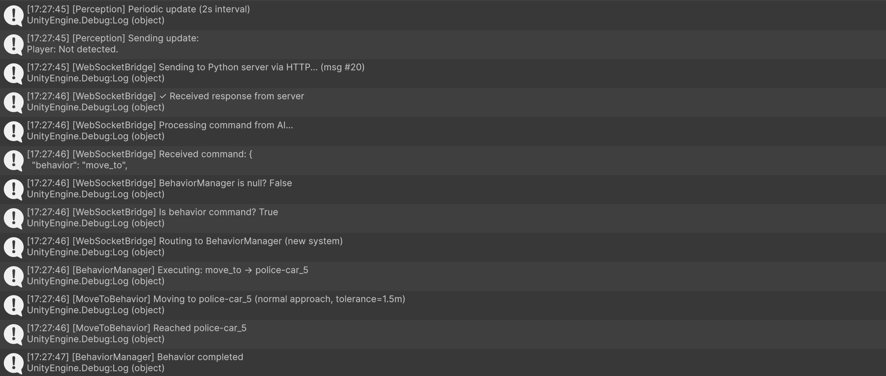
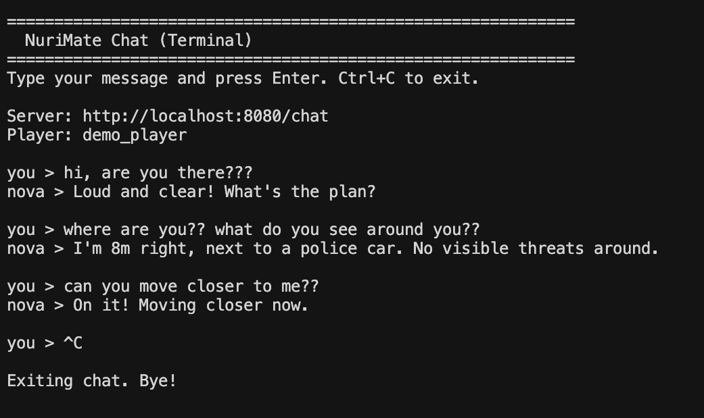

# NuriMate v0.1 - AI Teammate for Video Games

> **The most advanced synthetic relationship - an AI friend that plays video games with you**

An LLM-powered AI teammate that perceives game worlds through natural language, understands spatial relationships, and controls characters with human-like decision-making. We're building the most advanced synthetic relationships for gaming. Built for cost-efficiency and authentic behavior.

## 🎯 What Makes This Special

- **Text-Based Perception**: AI "sees" the game world through natural language descriptions, not raw data
- **Spatial Awareness**: Understands distances, directions, and relationships ("police car 5m ahead, buildings to the right")
- **Human-Like Control**: AI can play the game and interact with the world as human would
- **Real-Time Chat**: AI teammate you can talk to while it plays alongside you

## Our goals
- Build a fully autonomous, human-like AI teammate — a character that truly plays games with you, not just follows scripted commands.
- Start with Minecraft as our first environment — a moddable and open platform where we can create a functional, realistic version of the AI companion.
- Evolve toward integration with official game studios — after proving the technology works in moddable worlds, we aim to collaborate directly with developers to bring NuriMate into mainstream multiplayer games.
- Design for scale and cost-efficiency — the system must run smoothly, handle millions of players, and stay affordable for everyone.
- Set a new standard for synthetic relationships — making AI friendship natural, emotionally intelligent, and deeply human across games and virtual worlds.

* note - i am looking for a technical cofounder that would help me make these goals pobible. If you are interested please contact me through email at the bottom of this readme.


## 🚀 Quick Demo

```bash
# Terminal chat with AI
You: "What do you see around you?"
Nova: "Police car 5m ahead, apartment buildings to the right, no threats visible."

You: "Move to that police car"
Nova: "On my way to the police car now!"
```

Meanwhile, in Unity, the AI character executes the movement using NavMesh pathfinding.

## 📸 Screenshots

- Unity Console (behavior execution logs)



- Terminal Chat (real-time conversation with spatial context)



- In-Game View (AI teammate in the world)


## 🏗️ Architecture

```
┌─────────────────────────────────────────────────────────────┐
│                         Unity Game                          │
│  ┌──────────────┐        ┌─────────────┐                   │
│  │ Perception   │──Text──│ WebSocket   │                   │
│  │ System       │        │ Bridge      │                   │
│  └──────────────┘        └─────────────┘                   │
│         │                        │                          │
│         │                        │ HTTP                     │
└─────────┼────────────────────────┼──────────────────────────┘
          │                        │
          │ "Player: 15m ahead,    │
          │  police-car 5m left"   │
          │                        ▼
┌─────────┴────────────────────────────────────────────────────┐
│                   Python Backend (Flask)                     │
│  ┌──────────────────────────────────────────────────────┐   │
│  │  GPT-4o-mini (ultra-short perception prompt)         │   │
│  │  Input: Text perception + recent chat commands       │   │
│  │  Output: {"type":"behavior","behavior":"follow_player"}│   │
│  └──────────────────────────────────────────────────────┘   │
│         │                         │                          │
│         │ Behavior Command        │ Chat Response            │
└─────────┼─────────────────────────┼──────────────────────────┘
          │                         │
          ▼                         │
┌─────────────────────────────────────────────────────────────┐
│                      Unity Game                             │
│  ┌──────────────┐        ┌─────────────────────────────┐   │
│  │ Behavior     │────────│ Follow / MoveTo / TakeCover │   │
│  │ Manager      │        │ HoldPosition Behaviors      │   │
│  └──────────────┘        └─────────────────────────────┘   │
│         │                                                    │
│         ▼                                                    │
│  ┌──────────────┐        ┌─────────────┐                   │
│  │ Command      │────────│ NavMesh     │                   │
│  │ Executor     │        │ Agent       │                   │
│  └──────────────┘        └─────────────┘                   │
└─────────────────────────────────────────────────────────────┘
```

### Key Components

**Unity (C#)**
- `PerceptionSystem.cs` - Converts game state to natural language with change detection
- `BehaviorManager.cs` - Routes LLM commands to appropriate behaviors
- `CommandExecutor.cs` - Low-level movement and actions via NavMesh
- `Behaviors/` - FollowBehavior, MoveToBehavior, TakeCoverBehavior, HoldPositionBehavior

**Python Backend**
- `server.py` - Flask server handling perception and chat endpoints
- `perception_prompt.txt` - Ultra-short prompt for game control (~250 tokens)
- `chat_prompt.txt` - Conversational prompt with spatial awareness
- `memory_system.py` - Short-term chat history and long-term memories
- `personality.py` - AI character traits and behavior style

## 📦 Setup Guide

### Prerequisites

- **Unity 2022.3+** (with Universal Render Pipeline)
- **Python 3.9+**
- **OpenAI API Key**

### Installation

#### 1. Clone Repository

```bash
git clone https://github.com/yourusername/nurimate.git
cd nurimate
```

#### 2. Python Backend Setup

##### 2a. Prerequisites - Get Your API Key

The AI needs an API key from an LLM provider to think and respond:


##### 2b. Install Dependencies

```bash
cd nurimate_backend

# Create virtual environment
python3 -m venv venv
source venv/bin/activate  # On Windows: venv\Scripts\activate

# Install required packages
pip install -r requirements.txt
```

##### 2c. Create `.env` File with Your API Key

**Where to put it:**
```
nurimate_backend/
├── .env                 ← CREATE THIS FILE HERE
├── server.py
├── requirements.txt
└── prompts/
```

**How to create it:**

1. **Open your text editor** (VSCode, Notepad, TextEdit, etc.)
2. **Create a new empty file**
3. **Paste this content:**
```
LLM_API_KEY=sk-proj-YOUR-API-KEY-HERE
PLAYER_ID=demo_player
PORT=8080
DEBUG=True
```
4. **Replace `YOUR-API-KEY-HERE`** with your actual key from OpenAI (see section 2a)
   - Example: `LLM_API_KEY=sk-proj-1234567890abcdefghij1234567890`
5. **Save the file** as `.env` (note the dot!)
6. **Save it in:** `/Users/ondrejstanecka/Nurimate prototype/nurimate_backend/`
   - Must be in same folder as `server.py`

**That's it!** Your API key is now ready. The backend will automatically load it when you run `python3 server.py`.

⚠️ **IMPORTANT - Security:**
- Never share this file
- Never commit to GitHub (`.gitignore` protects it automatically)
- If you think someone sees your key, regenerate it on OpenAI website

##### 2d. Start the Backend Server

```bash
# Make sure you're in nurimate_backend/ folder and venv is activated
python3 server.py
```

**Expected output:**
```
 * Running on http://localhost:8080
 * Debugger enabled
```

**Server is now ready!** It will wait for Unity to connect.

#### 3. Unity Project Setup

##### 3a. Open the Project

1. **Open Unity Hub** on your computer
2. Click the **"Open"** button (top right)
3. Navigate to and select the entire **"Nurimate prototype"** folder
   - Path: `/Users/ondrejstanecka/Nurimate prototype`
   - NOT the subfolder "Nurimate prototype world" - select the parent folder
4. Unity will load the project (first load may take 1-2 minutes)
5. Once loaded, open our prototype scene: **"Nurimate prototype scene.unity"**
   - Path: `Nurimate prototype world/Assets/Scenes/Nurimate prototype scene.unity`
   - It contains a simple game world with the AI character and player

**The scene contains:**
- Procedurally generated city environment
- AI character (Banana Man model) 
- Player character ready to use
- Terrain and buildings
- Pre-configured components

##### 3b. Verify Backend Connection

**Before configuring anything, make sure:**

1. ✅ Python backend is running (see section 2d)
   - Check terminal shows: `Running on http://localhost:8080`
   
2. ✅ `.env` file has your API key configured (see section 2c)
   
3. ✅ Open the **"Nurimate prototype scene.unity"** in Unity

**The WebSocketBridge will automatically:**
- Detect the running backend server
- Connect to `http://localhost:8080`
- Begin sending perception data
- Receive and execute AI commands

If connection fails, check:
- Is backend running? → Start with `python3 server.py`
- Is API key set? → Check `.env` file has `LLM_API_KEY=...`
- Is firewall blocking port 8080? → Allow port 8080 in your firewall

##### 3c. Configure AI Character Components

The AI character needs several components to work. **Most are auto-configured**, but verify them:

1. Find the **`AI`** GameObject in the Hierarchy panel (left side)
2. Click on it to select it
3. In the **Inspector panel** (right side), you should see these components:

**Component Checklist:**

| Component | Status | What to Check |
|-----------|--------|---------------|
| `PerceptionSystem` | ✅ Auto-assigned | If empty: Assign `Main Camera`, `AI Transform`, `Player Transform` |
| `CommandExecutor` | ✅ Auto-assigned | Should work automatically once started |
| `BehaviorManager` | ✅ Auto-assigned | References `CommandExecutor` automatically |
| `WebSocketBridge` | ✅ Pre-configured | Server URL: `http://localhost:8080` (already set) |
| `NavMeshAgent` | ⚠️ Requires NavMesh | See "Setup NavMesh" below |

**If manual assignment needed:**
1. Select the AI GameObject
2. In Inspector, find `PerceptionSystem` component
3. For `AI Transform`: Drag the AI object to this field
4. For `Player Transform`: Drag the Player object to this field
5. For `Main Camera`: Drag the Main Camera to this field

##### 3d. Setup NavMesh (Required for AI Movement)

The AI uses NavMesh to navigate and avoid obstacles:

1. Select **all walkable objects** in the scene (ground, roads, floors)
   - Hold Ctrl/Cmd and click each object, or use Ctrl+A
2. In **Inspector** → Check **"Navigation Static"**
3. Go to **Window** → **AI** → **Navigation**
4. Click **Bake** button
5. Wait for baking to complete (~10-30 seconds)

If AI doesn't move after clicking Play:
- Check Console for error: `"No valid NavMesh"`
- If shown: Re-bake the NavMesh (steps 1-5 above)

##### 3e. Verify Player Object Setup

The AI needs to find the Player to follow it:

1. Select **Player** GameObject in Hierarchy
2. Verify:
   - Name is exactly `"Player"`
   - Has a Collider component (Capsule, Box, or Sphere)
   - Has Tag = `"Player"` (create if needed)
3. In the Player's `CommandExecutor` component:
   - `Player Transform` should auto-assign to itself

#### 4. Test Everything Works

##### Prerequisites Before Testing:
- ✅ Python backend running: `python3 server.py` (showing `Running on http://localhost:8080`)
- ✅ `.env` file configured with API key
- ✅ Unity project opened with "Nurimate prototype scene.unity"
- ✅ AI and Player GameObjects visible in scene
- ✅ NavMesh baked (no errors in Console)

##### 4a. Test AI Movement (In Unity)

1. **Press Play** button in Unity (top center)
2. In the **Scene window**, you should see AI character moving toward Player
3. **Check Console** (bottom of screen) for these success messages:
   ```
   [WebSocketBridge] ✓ Connected to AI server at http://localhost:8080
   [BehaviorManager] ✓ Pre-initialized Player Transform
   [Perception] Sending update to AI...
   [PerceptionSystem] Text perception sent successfully
   ```
4. **Expected behavior:**
   - AI moves toward player and maintains distance
   - AI avoids obstacles (buildings, terrain)
   - Game stops when you press Stop button

**If AI doesn't move:**
- Check Unity Console for errors (red text)
- Common issues:
  - Backend not running? → Start `python3 server.py`
  - NavMesh not baked? → Re-bake it (section 3d)
  - No firewall rule for port 8080? → Add exception

##### 4b. Test Chat Commands (Terminal)

In a **new terminal window** (separate from backend):

```bash
cd nurimate_backend
python3 cli_chat.py
```

Try these commands:
```
> "hi how are you?"
> "where are you right now?"
> "what do you see?"
> "move to that building over there"
> "what's your name?"
```

**Expected:** AI responds naturally about what it sees in game.

##### 4c. Full Integration Test

1. **Terminal 1:** Backend running (`python3 server.py`)
2. **Terminal 2:** Chat session (`python3 cli_chat.py`)
3. **Unity:** Press Play
4. In Terminal 2, type: `"move to that police car"`
5. In Unity, watch AI move to the object
6. In Terminal 2: `"where are you now?"`
7. **Expected:** AI tells you its location based on actual game state

**🎉 If all these work, your system is fully configured!**

## 🎮 Usage

### In-Game Commands (via terminal chat)

```bash
# Movement
"follow me"
"move to that police car"
"stay here" / "wait here"

# Tactical
"take cover behind that building"
"hold position and scan area"

# Information
"where are you?"
"what do you see?"
"any threats?"
```

### Preparing Your World for NuriMate AI

**⚠️ Important:** The demo scene is partially prepared. Not all objects have `AIReadable` components yet. To get the best results, you'll need to set up your world for the AI system. This guideline can also be used to implementing our system to a completly new unity worlds and scenes.


#### Step 1: Add AIReadable Components

Make objects "visible" to the AI by tagging them with AIReadable:

1. Select an object in Unity (e.g., a building, car, or landmark)
2. In Inspector → Add Component → Search for `AIReadable`
3. Configure the following:

```
Object Name:        police-car_5          (unique identifier for AI)
AI Description:     "Blue police cruiser" (how AI describes it)
Object Type:        Important             (dropdown: Important/Landmark/Obstacle)
Can Provide Cover:  ✓ (if it can hide behind)
Is Interactive:     ✓ (if AI can interact with it)
```

* note - Dont put AIReadable to all objects, it would be too much data for llm. Chosse important objects only when adding airedable (put ai readable to building cars and objects that metter, dont put it to fire hydrants, walls or detailes about objects. Put it only to objects importtant in the game world)


#### Step 2: Naming Convention (Important!)

AI needs consistent, machine-readable names to work reliably:

**Good Names:**
- `police-car_5` (type_number)
- `apartment-building_A` (type_identifier)
- `fire-station` (unique landmark)
- `park-bench_12` (type_number)

**Bad Names:**
- `Car` (too generic, AI can't distinguish)
- `Object_1` (meaningless)
- `Beautiful Red Building` (not machine-readable)

#### Step 3: Strategic Object Placement

Prioritize AIReadable on objects that are:
1. **Landmarks** - Buildings, bridges, monuments (helps navigation)
2. **Cover Points** - Cars, walls, obstacles (tactical awareness)
3. **Destinations** - Specific locations AI might go to
4. **Interactive Objects** - Things AI should know about

**Start with ~20-30 key objects**, not every single thing in the scene.

#### Step 4: Test Configuration

After adding AIReadable components:
1. Start the game
2. Open terminal chat: `python3 cli_chat.py`
3. Type: `"What do you see?"`
4. AI should mention the objects you configured

**Expected response:**
```
"Police car 8m left (cover), apartment building 15m right, 
 fire station 25m behind."
```

If AI doesn't mention your objects:
- Check if `AIReadable` component is enabled
- Verify object names have no spaces or special characters
- Make sure object is within 50m detection range
- Check `PerceptionSystem` in Unity is running

#### Example: Setting Up a Small Area

To set up a small playable area (street intersection):

| Object | Name | Cover | Interactive | Priority |
|--------|------|-------|-------------|----------|
| Police Car | police-car_5 | Yes | No | High |
| Fire Hydrant | hydrant_1 | No | Yes | Low |
| Building A | building-A | No | No | Medium |
| Park Bench | bench_1 | No | No | Low |
| Traffic Light | traffic-light_1 | No | No | Low |

**Rough guideline:** Start with 20-30 objects, then expand as needed.

#### Step 5: Add Player Character to the World

The Player is the human-controlled character. Set it up first:

1. **Create Player GameObject:**
   - In Hierarchy → Right-click → 3D Object → Choose a model (Capsule for simple test)
   - Name it: `Player` (IMPORTANT - AI searches by this name)
   - Position: Somewhere in your scene (e.g., 0, 0, 0)
   - Add a Collider component (Capsule Collider)

2. **Add Player Script (Optional):**
   - Add Component → `AIFriendController` (this is the main AI controller)
   - **DON'T** add this to Player - it goes on AI!
   - For Player, you can use Unity's default FPS/TPS controller

3. **Tag the Player:**
   - Select Player GameObject
   - In Inspector → Tag dropdown → Create new tag called `Player`
   - Assign it to the Player GameObject
   - (This helps AI find the player if naming fails)

**Player Checklist:**
- [ ] GameObject named exactly: `Player`
- [ ] Has Collider component
- [ ] Tagged with `Player` tag
- [ ] Positioned in the scene

---

#### Step 6: Add AI Character to the World (CRITICAL SETUP)

The AI character is controlled by LLM and Unity behaviors. This is the most important setup:

**1. Create AI GameObject:**
- In Hierarchy → Right-click → 3D Object → Capsule (or your AI model)
- Name it: `AI` (or `AIFriend`)
- Position: Different from Player (e.g., 5, 0, 5)
- Add a Collider component (Capsule Collider)

**2. Add Required Components (in order):**

The AI needs multiple interconnected components. The easiest way is to use `AIFriendController`, which auto-configures everything:

a) **Add AIFriendController:**
   - Select AI GameObject
   - In Inspector → Add Component → Search for `AIFriendController`
   - Click to add

b) **Configure AIFriendController:**
   - In Inspector, find `AIFriendController` section
   - **References:**
     - Drag your **Player** GameObject into `Player` field
     - Drag the **Main Camera** into `Main Camera` field
   
   - This auto-adds and configures:
     - ✅ NavMeshAgent (for pathfinding)
     - ✅ CommandExecutor (movement commands)
     - ✅ PerceptionSystem (world awareness)
     - ✅ WebSocketBridge (LLM communication)
     - ✅ All interconnections between them

**3. Manual Verification (if auto-setup doesn't work):**

If you prefer to add components manually, check that AI has:
- [x] **NavMeshAgent** - Enables pathfinding
- [x] **CommandExecutor** - Executes movement commands
  - `Player Transform` → Drag Player here
  - `Nav Agent` → Drag NavMeshAgent here
  - `AI Transform` → Set to AI's own Transform
- [x] **PerceptionSystem** - Sees the game world
  - `Main Camera` → Drag Main Camera
  - `AI Transform` → Set to AI's own Transform
  - `Player Transform` → Drag Player
- [x] **BehaviorManager** - Routes commands
  - `Command Executor` → Drag CommandExecutor
- [x] **WebSocketBridge** - Connects to LLM
  - `Command Executor` → Drag CommandExecutor
  - `Perception System` → Drag PerceptionSystem
  - `Server URL` → `http://localhost:8080`

**4. Set up NavMesh:**
This is REQUIRED for AI movement!
- Select all walkable objects (ground, roads, terrain)
- Inspector → Navigation section → Check "Navigation Static"
- Window → AI → Navigation
- Click "Bake" button
- Wait for bake to complete

**AI Character Checklist:**
- [ ] GameObject named: `AI` or `AIFriend`
- [ ] Has Collider
- [ ] Has NavMeshAgent component
- [ ] Has AIFriendController (or manual components)
- [ ] Player reference is assigned
- [ ] Main Camera reference is assigned
- [ ] NavMesh is baked
- [ ] Server URL is `http://localhost:8080`

---

#### Current State (v0.1)

The demo scene has:
- ✅ Basic environment with terrain, buildings, and roads
- ✅ Player character in the world
- ✅ AI character with movement capabilities
- ✅ AIFriendController auto-configures all systems
- ⚠️ **NOT all objects configured with AIReadable** (you'll see generic references)
- ⚠️ Navigation is basic (just walking, no climbing/jumping)

**To get started:**
1. Add Player character (Step 5)
2. Add AI character with AIFriendController (Step 6)
3. Configure AIReadable on key objects (Steps 1-4)
4. Bake NavMesh
5. Run the system!

## 💰 Cost Analysis (v0.1 Architecture)

**Current Operating Costs:**
- Perception calls: ~720 calls/hour (every 5s) × $0.00012 = **~$0.086/hour**
- Chat messages: ~20 messages/hour × $0.00027 = **~$0.005/hour**
- **Total: ~$0.09/hour** or **~$2/day** for continuous gameplay

**⚠️ Important Caveat:**
These costs are only this low because the **v0.1 system is intentionally simple**. The architecture has been optimized for proof-of-concept, not production use.

**Current cost optimizations (v0.1 only):**
- Text-based perception: 87% token reduction vs JSON
- Change detection: ~70% fewer API calls
- Ultra-short prompts: ~250 tokens vs ~2000 tokens for full system
- Stateless perception: No conversation history overhead

## 🔬 Technical Highlights

### 1. Text-Based Perception

Instead of sending raw JSON game state:
```json
{"player": {"position": [15.2, 0, 8.3], "health": 100}, ...}
```

We send natural language:
```
Player: 15m ahead, moving.
Nearby: police-car 5m left (cover), building-A 23m right.
Threats: None visible.
```

This is:
- ✅ More natural for LLM reasoning
- ✅ 87% fewer tokens
- ✅ Easier to debug and tune

### 2. Behavior System Architecture

**Two-Layer Control:**
- **Strategic Layer (LLM)**: "I should follow the player"
- **Tactical Layer (Unity)**: NavMesh pathfinding, obstacle avoidance, actual movement

This separation means:
- LLM doesn't need to know about Unity physics
- Unity handles all low-level details
- Cost-efficient (LLM makes decisions, not movements)

### 3. Change Detection

Perception only updates when:
- AI moved >3m
- Player moved >5m
- Visible objects changed
- 2s periodic update (fallback)

Reduces unnecessary API calls by ~70%.

## 🐛 Honest Assessment: What Works & What Doesn't

This is **v0.1 - a working prototype**, not a complete product. Here's the real status:

### ✅ What Actually Works

**Core AI Systems:**
- ✅ **Perception engine** - AI receives spatial information about the game world
- ✅ **Decision making** - LLM generates logical behavior decisions
- ✅ **Behavior execution** - AI reliably follows player, moves to targets, uses cover
- ✅ **Game-to-LLM bridge** - Natural language communication between Unity and backend
- ✅ **Change detection** - Efficient perception updates (only when significant)

**Chat & Interaction:**
- ✅ **Terminal chat UI** - Functional text-based communication
- ✅ **Contextual responses** - Chat AI sees current game state
- ✅ **Basic spatial awareness** - AI can describe where it is

**Architecture:**
- ✅ **Modular system** - Easy to add new behaviors


### ❌ What Doesn't Work (or Barely Works)

**Game World & Gameplay:**
- ❌ **Not actually playable** - No proper camera, no input system, world is broken
- ❌ **Minimal world complexity** - Just a demo scene, no real game mechanics
- ❌ **Only walking** - AI can only move around; no jumping, no interaction, no combat
- ❌ **No threats/enemies** - Threat system is placeholder, doesn't actually detect danger

**Communication:**
- ❌ **No voice** - No STT/TTS implementation, text-only
- ❌ **Limited personality** - AI doesn't have true relationship dynamics

**AI Capabilities:**
- ❌ **Limited behaviors** - Only 4 behaviors (follow, move_to, take_cover, hold_position)
- ❌ **No memory** - AI doesn't remember visited locations or past events
- ❌ **Single AI only** - No multi-agent coordination or teamwork
- ❌ **No learning** - AI doesn't adapt or improve over time

### ⚠️ Gray Zone (Partially Working)

- ⚠️ **Latency** - ~1-2 seconds per decision (fine for strategy, not for fast-paced action)
- ⚠️ **Navigation** - Works but requires manual NavMesh setup
- ⚠️ **Chat realism** - Context-aware but still has "generic LLM" feel sometimes
- ⚠️ **System prompts** - Tuned for v0.1, will need rewrite for complex behaviors

### 🎯 Architecture Note

**Current system (v0.1):**
- Intentionally simple for proof-of-concept
- Optimized to show the core concept works
- Cost-efficient only *because* it's simple

**Production system will need:**
- Complex decision trees and reasoning
- Multi-layer perception (visual, audio, tactical)
- Threat modeling and risk assessment  
- Memory and learning systems
- **Result: 5-10x higher token usage, 5-10x higher cost**

**The Goal:** This prototype proves the concept works. Production version will add complexity (and cost) as needed.


## 📊 Performance Benchmarks

**Tested on MacBook Air M2:**
- Perception generation: ~2ms
- HTTP round-trip to backend: ~300-500ms
- LLM response time: ~800-1200ms
- Total latency: ~1-2 seconds per decision

**For production:**
- Use streaming responses for faster UX
- Consider local LLM for perception (faster but less capable)
- Cache common responses

## 🛠️ Tech Stack

**Frontend (Unity)**
- Unity 2022.3 LTS
- Universal Render Pipeline (URP)
- NavMesh for pathfinding
- Unity Coroutines for async behavior

**Backend (Python)**
- Flask + Flask-Sock
- OpenAI GPT-4o-mini
- JSON serialization
- HTTP polling (simple, reliable)

**Why these choices:**
- **GPT-4o-mini**: Best cost/performance ratio ($0.15/1M input tokens)
- **HTTP polling**: Simpler than WebSockets, reliable, easy to debug
- **Text-based**: Natural for LLMs, efficient, readable
- **Behavior pattern**: Proven game AI architecture

## 🤝 Contributing

This is a prototype.Please feel free to:
- Open issues for bugs
- Share ideas in discussions
- Fork and experiment
- Share your feedback 

 Also if you like my vision, you have a technical skills and want to become part of this project, please contact me through email on bottom. I am currently looking for a cofounder that would help me with this project.

## 📄 License

MIT License - see LICENSE file

## 📧 Contact

- **Creator**: Ondřej Stanečka
- **Email**: ceo@nurimate.com

---

**Current Status**: Prototype v0.1 - Working AI teammate with natural language understanding and spatial awareness. Core systems functional, ready for expansion.

**Last Updated**: November 2025 (v0.1 Prototype)

